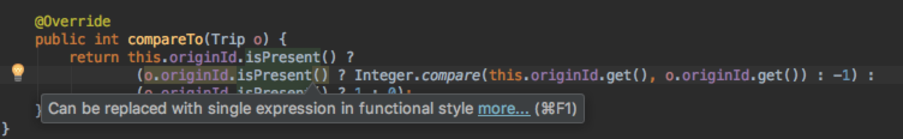
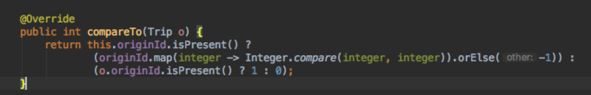

# Simple demo for bug report

After running this suggested refactoring in `Trip.java` the `TripTest.java` unit test will flip from passing to failing as the implementation no longer is actually comparing the two. 

